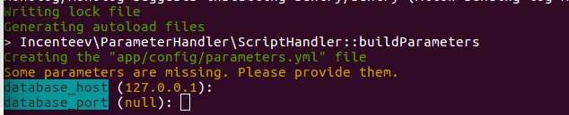
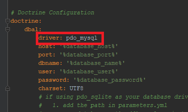

// instructions here

## Installation 

//instructions here

- Install Apache2

To check if Apache2 is installed and know which version you have:
````
apache2 -v
````

If Apache2 is not installed, run : 
````
apt-get install apache2
````

- Install php

To check if php is installed and know what version you have:
````
php -v
````

If php is not installed, run:
````
 apt-get install php5-common libapache2-mod-php5 php5-cli
````

- Clone the repository on the server : 
The repository need to be cloned in a folder specified in the Apache2 configuration.
We will asume in this document this folder is var/www/html.

Run the git command where you want to put the repository: 
````
git clone https://github.com/JorisMillot/APIExtendedDocument.git
````

- Install composer:
From var/www/html/APIExtendedDocument run:
````
php -r "copy('https://getcomposer.org/installer', 'composer-setup.php');"
php -r "if (hash_file('SHA384', 'composer-setup.php') === '544e09ee996cdf60ece3804abc52599c22b1f40f4323403c44d44fdfdd586475ca9813a858088ffbc1f233e9b180f061') { echo 'Installer verified'; } else { echo 'Installer corrupt'; unlink('composer-setup.php'); } echo PHP_EOL;"
php composer-setup.php
php -r "unlink('composer-setup.php');"
composer require apache-pack
````

- Install postgreSQL

Note : on the second line, replace X.X by the correct version of php that you have
Run:
````
apt-get install postgresql postgresql-client    //Install postgreSQL
apt-get install phpX.X-pgsql                    //Install the driver to use postgresql with PHP
su - postgres
psql
\q
````

- Update the project dependencies : 
You need to run the following command : 
````
sudo composer update
````
It will update the project's dependencies and should ask you informations on the database to connect the project to the database :



- Configure the Database: 

If you need to update or configure your database connection information. You just have to open the file app/config/parameters.yml and put correct values to the lines beginning with 'database_': server, name, user, password.
For example:

````
   parameters:
    database_host: 127.0.0.1 (if you want to use localhost)
    database_port: 5432
    database_name: your_db_name
    database_user: postgres
    database_password: root
    mailer_transport: smtp
    mailer_host: 127.0.0.1
    mailer_user: null
    mailer_password: null
    secret: ThisTokenIsNotSoSecretChangeIt
````

The following command will an empty 'your_db_name' database:
````
php bin/console doctrine:database:create
````

You'll get:
"Created database "<your_db_name>" for connection named default" à l'exécution de php bin/console doctrine:database:create

Update the database:
```` 
php bin/console doctrine:schema:update --force
````

Open your navigator and run: 
{path_to_your_project}/APIExtendedDocument/web/app_dev.php/displayDocuments

You should have:


If you want to use another type of database instead of postgreSQL you will need to change the driver used by the project in the file /app/config/config.yml : 



Don't forget to install/enable the required driver.

- Permissions:

We need to allow to upload files to the directory called 'documentsDirectory'.
````
HTTPDUSER=$(ps axo user,comm | grep -E '[a]pache|[h]ttpd|[_]www|[w]ww-data|[n]ginx' | grep -v root | head -1 | cut -d\  -f1)
sudo setfacl -dR -m u:"$HTTPDUSER":rwX -m u:$(whoami):rwX var
sudo setfacl -R -m u:"$HTTPDUSER":rwX -m u:$(whoami):rwX var
sudo setfacl -dR -m u:"$HTTPDUSER":rwX -m u:$(whoami):rwX web/documentsDirectory
sudo setfacl -R -m u:"$HTTPDUSER":rwX -m u:$(whoami):rwX web/documentsDirectory 
````
